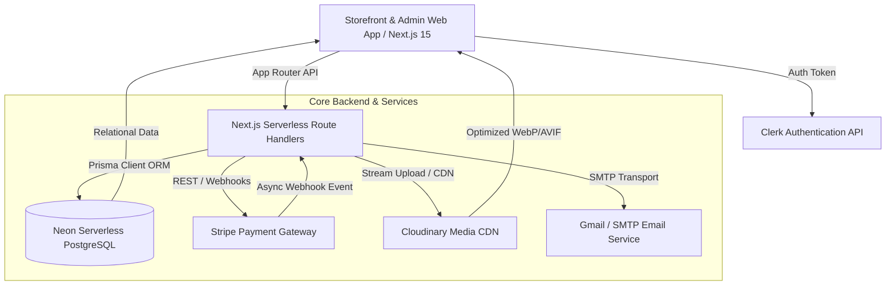
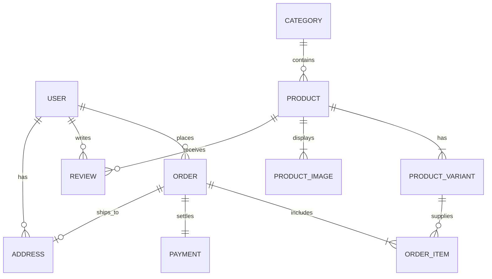
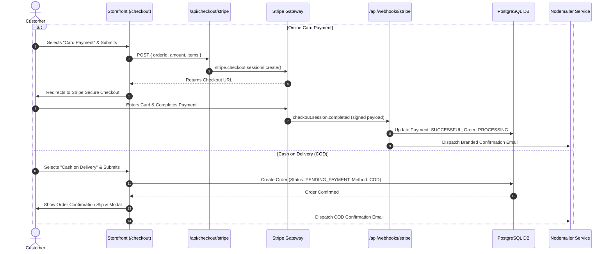
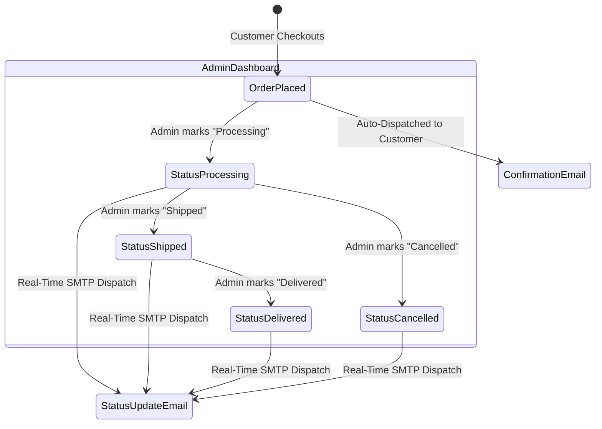
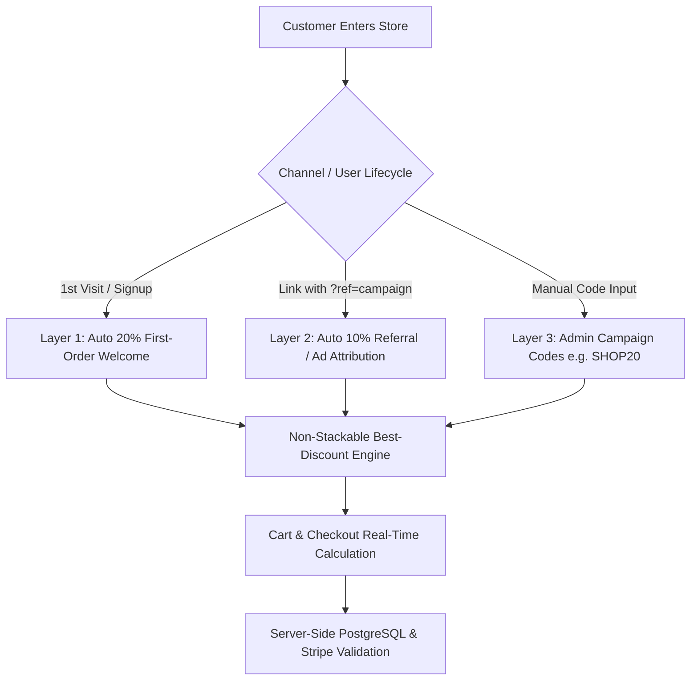

# 🛍️ SHOP.CO — Full-Stack E-Commerce Platform
## Technical Architecture, Subsystems & Mentor Presentation Guide

> **Prepared for**: Academic Mentor / Technical Reviewer / Portfolio Defense  
> **Project Repository**: `hassamnaveed44/e-commerce`  
> **Tech Stack**: Next.js 15+ (App Router), TypeScript, Tailwind CSS, PostgreSQL (Neon), Prisma ORM, Clerk Auth, Stripe, Cloudinary CDN, Nodemailer.

---

## 📑 Table of Contents
1. [Executive Summary](#1-executive-summary)
2. [High-Level System Architecture](#2-high-level-system-architecture)
3. [Database Schema & Data Modeling](#3-database-schema--data-modeling)
4. [Deep-Dive: Stripe & Cash on Delivery (COD) Payment Engine](#4-deep-dive-stripe--cash-on-delivery-cod-payment-engine)
5. [Deep-Dive: Cloudinary CDN & Image Storage Pipeline](#5-deep-dive-cloudinary-cdn--image-storage-pipeline)
6. [Deep-Dive: Multi-Variant Inventory & Dynamic Stock Engine](#6-deep-dive-multi-variant-inventory--dynamic-stock-engine)
7. [Deep-Dive: Automated Transactional Email System](#7-deep-dive-automated-transactional-email-system)
8. [Deep-Dive: Admin Security, RBAC & Financial Ledger](#8-deep-dive-admin-security-rbac--financial-ledger)
9. [Storefront UX: Dynamic Filtering & Price Aggregation](#9-storefront-ux-dynamic-filtering--price-aggregation)
10. [Senior Engineering Decisions & Challenges Solved](#10-senior-engineering-decisions--challenges-solved)
11. [2-Minute Elevator Pitch / Live Demo Script](#11-2-minute-elevator-pitch--live-demo-script)

---

## 1. Executive Summary

**SHOP.CO** is an enterprise-grade, full-stack apparel e-commerce web application engineered to solve real-world retail problems: **dynamic color-specific variant stock**, **hybrid payment accounting (Stripe Card vs. Doorstep Cash on Delivery)**, **zero-downtime CDN media streaming**, and **event-driven transactional email workflows**.

Unlike standard student CRUD demos that use mock JSON arrays and simulated checkouts, SHOP.CO is backed by a **live PostgreSQL relational database**, **live Stripe webhooks**, **live SMTP email dispatch**, and **serverless Cloudinary asset pipelines** deployed in production on **Vercel**.

---

## 2. High-Level System Architecture



### Architectural Pillars:
* **Framework**: Next.js 15+ with Turbopack and React Server/Client Components.
* **Database & ORM**: Neon Serverless PostgreSQL with Prisma ORM for type-safe queries, relational cascades, and atomic ACID transactions.
* **Security & Auth**: Clerk Authentication combined with a server-side Admin Access Request Whitelisting gate.
* **CDN Infrastructure**: Cloudinary SDK for serverless streaming uploads with automatic format optimization (`f_auto`, `q_auto`).
* **Financial Services**: Stripe Checkout API with cryptographic webhook validation and dual-currency conversion (USD & PKR).

---

## 3. Database Schema & Data Modeling

The relational database architecture is defined in `prisma/schema.prisma` with 11 relational models ensuring referential integrity:



### Key Models & Relationships:
1. **`Product` & `ProductVariant`**:
   * A product has multiple variants (Size + Color combination). Each variant tracks its own individual SKU, color hex, color name, and `stockQuantity`.
2. **`ProductImage`**:
   * Supports both external CDN URLs (`url`) and Cloudinary identifiers (`publicId`) with `isPrimary` sorting.
3. **`Order` & `Payment`**:
   * Decoupled 1-to-1 relationship. An order can be created with `paymentMethod = "COD"` (payment status `PENDING`) or `paymentMethod = "CARD"` (payment status `SUCCESSFUL` via Stripe).
4. **`Review`**:
   * Tracks customer feedback, star ratings (1.0–5.0), and flags `isVerifiedPurchase` by verifying order history.

---

## 4. Deep-Dive: Stripe & Cash on Delivery (COD) Payment Engine

SHOP.CO implements a **dual-channel payment architecture**:



### 💳 Stripe Integration Implementation:
1. **Session Creation** ([`app/api/checkout/stripe/route.ts`](file:///d:/e-commerce/shop-co/app/api/checkout/stripe/route.ts)):
   * Constructs line items from cart, attaches metadata (`orderId`, `userId`), and sets success/cancel redirects.
2. **Cryptographic Webhook Verification** ([`app/api/webhooks/stripe/route.ts`](file:///d:/e-commerce/shop-co/app/api/webhooks/stripe/route.ts)):
   * Verifies `stripe-signature` header using `STRIPE_WEBHOOK_SECRET` to prevent replay attacks and fraudulent payload injection.
3. **COD Accurate Accounting**:
   * Cash on Delivery orders are explicitly tagged as `PENDING_PAYMENT` with an amber badge rather than falsely marked as paid.
   * Customers receive a downloadable receipt slip modal with print capability.

---

## 5. Deep-Dive: Cloudinary CDN & Image Storage Pipeline

### ❓ The Problem with Vercel Serverless File Uploads:
On serverless platforms like Vercel, the local filesystem (`/public/uploads`) is **read-only and ephemeral** (files written to disk are destroyed as soon as the serverless instance scales down).

### 💡 The Solution: Cloudinary Stream Upload Architecture
SHOP.CO implements a robust hybrid upload engine in [`lib/cloudinary.ts`](file:///d:/e-commerce/shop-co/lib/cloudinary.ts) and [`app/api/admin/upload/route.ts`](file:///d:/e-commerce/shop-co/app/api/admin/upload/route.ts):

```mermaid
graph LR
    Admin[Admin Upload UI] -->|multipart/form-data| Route[/api/admin/upload]
    Route --> Check{Cloudinary Configured?}
    Check -->|Yes / Production| Stream[cloudinary.uploader.upload_stream]
    Stream --> CloudinaryCDN[Cloudinary CDN Cloud Storage]
    CloudinaryCDN --> SaveDB[(Prisma ProductImage Table)]
    Check -->|No / Local Fallback| Disk[Local /public/uploads Disk]
    Disk --> SaveDB
```

1. **Dual Configuration Support**: Supports either single connection string `CLOUDINARY_URL` or individual environment variables (`CLOUDINARY_CLOUD_NAME`, `CLOUDINARY_API_KEY`, `CLOUDINARY_API_SECRET`).
2. **Buffer-to-Stream Pipe**: Converts incoming `File` Blob into a Node.js Buffer, piping it directly into `cloudinary.uploader.upload_stream` with folder grouping (`e-commerce/products`).
3. **Next.js Image Optimization**: Configured `res.cloudinary.com` inside `images.remotePatterns` in [`next.config.ts`](file:///d:/e-commerce/shop-co/next.config.ts) for automatic WebP/AVIF compression.

---

## 6. Deep-Dive: Multi-Variant Inventory & Dynamic Stock Engine

Most e-commerce platforms evaluate sizes globally, leading to customer frustration (e.g. clicking White, then selecting Small, only to find Small is out of stock in White).

### 🎨 Color-Specific Size Availability Logic:
In [`app/components/product/ProductInfo.tsx`](file:///d:/e-commerce/shop-co/app/components/product/ProductInfo.tsx):
1. **Dynamic Stock Matrix**: Sizes are filtered and checked against the **currently selected color**:
   ```typescript
   const isSizeInStockForColor = (sizeName: string) => {
     const matchingVariant = product.variants.find(
       (v) =>
         v.colorHex.toLowerCase() === selectedColor.toLowerCase() &&
         v.size.toLowerCase() === sizeName.toLowerCase()
     );
     return matchingVariant ? matchingVariant.stockQuantity > 0 : false;
   };
   ```
2. **Visual Feedback & Auto-Selection**:
   * If a size has 0 stock in the active color, it is rendered **struck-through and disabled** (`line-through opacity-50 cursor-not-allowed`).
   * Switching color swatches automatically updates size availability and auto-selects the first available size in that color.
   * Real-time stock status badge: `✓ In Stock (X)`, `🔥 Only X left!`, or `✕ Out of Stock`.
3. **Atomic Stock Decrement**:
   * Orders are processed inside `prisma.$transaction` to guarantee that concurrent checkouts cannot oversell inventory.

---

## 7. Deep-Dive: Automated Transactional Email System

SHOP.CO includes an event-driven email engine built in [`services/email.service.ts`](file:///d:/e-commerce/shop-co/services/email.service.ts):



### Features:
1. **Zero-Configuration Gmail Auto-Detection**: Sanitizes input and automatically configures Gmail SMTP ports (`465` SSL / `587` TLS).
2. **Dynamic Customer Email Sync**: In [`services/order.service.ts`](file:///d:/e-commerce/shop-co/services/order.service.ts), guest checkout emails are linked directly to the order record so receipts and tracking updates always reach the purchaser.
3. **Branded HTML Templates**: Modern responsive email templates with order number, order item breakdown, shipping address, and tracking status.
4. **Admin Test Tool**: Built-in `/api/admin/test-email` allows administrators to test and verify SMTP connections with 1 click from the dashboard.

---

## 8. Deep-Dive: Admin Security, RBAC & Financial Ledger

### 🛡️ Admin Security & Gating
* Protected by Clerk Authentication and an `AdminAuthGate` component.
* Unauthenticated or non-whitelisted users see an interactive access request form that sends permission requests directly to the store owner.

### 📊 Real-Time Financial Ledger & Settlements ([`/admin/payments`](file:///d:/e-commerce/shop-co/app/admin/payments/page.tsx))
* **Total Balance Overview**: Real-time aggregation of completed card payments and collected cash.
* **Dual Currency Converter**: Live USD $\leftrightarrow$ PKR calculation based on the current market exchange rate ($1\text{ USD} = 279\text{ PKR}$).
* **Upcoming Settlements Pipeline**:
  * **COD Pending**: Tracks orders in transit awaiting courier delivery and cash collection.
  * **Stripe Clearing**: Tracks card payments in Stripe's 2-day rolling bank deposit window.

---

## 9. Storefront UX: Dynamic Filtering & Price Aggregation

1. **Multi-Department & Style Navigation** ([`Navbar.tsx`](file:///d:/e-commerce/shop-co/app/components/common/Navbar.tsx)):
   * **Departments**: *Men's*, *Women's*, *Kids*.
   * **Dress Styles**: *Casual*, *Formal*, *Party*, *Gym*.
   * **Popular Categories**: *Full Suits*, *Pant Shirt*, *Three Piece*, *T-Shirts*, *Jeans*, *Hoodies*.
2. **Instant Price Slider & Dynamic Price Bounds** ([`FiltersSidebar.tsx`](file:///d:/e-commerce/shop-co/app/components/category/FiltersSidebar.tsx)):
   * Database price aggregation (`_min.price` and `_max.price`) feeds dynamic catalog bounds to the client.
   * `onMouseUp` and `onTouchEnd` events trigger seamless instant filtering without reloading the page.
3. **Smart Empty States** ([`ProductGrid.tsx`](file:///d:/e-commerce/shop-co/app/components/category/ProductGrid.tsx)):
   * If a filter produces 0 results, it explains *why* (e.g. *"No products available in size '4X-Large'. Available sizes: Small, Medium, Large."*) and provides a 1-click **Reset Filter** button.

---

## 10. Deep-Dive: Automated Tiered Discounts & Referral Attribution Engine

Unlike basic e-commerce apps where discounts require manual typing and are vulnerable to coupon-stacking exploits, SHOP.CO implements a **3-Layer Smart Promotion Engine**:



### Key Engineering Pillars:
1. **Frictionless First-Order Welcome**: Automatically detects new customer sessions and applies `WELCOME20` (20% off) with celebration pill feedback (`🎉 20% First-Order Welcome Discount Applied`).
2. **Referral / Ad Campaign Attribution**: URL parameters (e.g. `?ref=influencer10` or `?promo=ad10`) are captured in session storage and auto-applied in the cart without user friction.
3. **Anti-Stacking Margin Protection**: Enforces single best-discount precedence, preventing malicious customers from combining codes (e.g., 20% + 20% + 10% = 50% exploit).
4. **Full Server-Side Verification**: In [`services/order.service.ts`](file:///d:/e-commerce/shop-co/services/order.service.ts), the backend independently recalculates and cryptographically validates the discount before charging Stripe or creating order records.

---

## 11. Senior Engineering Decisions & Challenges Solved

| Challenge | Typical Junior Approach | SHOP.CO Senior Solution |
| :--- | :--- | :--- |
| **Vercel Ephemeral Storage** | Saving uploads to `/public/uploads` (breaks on Vercel) | Implemented **Cloudinary streaming upload** with automatic fallback. |
| **Git Deployment Risks** | Pushing untested code directly to `main` | Used **dedicated feature branches** (`feature/*`) with full local build validation (`tsc` & `next build`) before merging to `main`. |
| **Variant Stock Overselling** | Separate API calls that can cause race conditions | Used **`prisma.$transaction`** to atomically create orders and decrement variant inventory. |
| **Coupon Stacking Exploits** | Blind client-side calculation | Built **anti-stacking best-discount engine** with server-side validation. |
| **Dark Mode UI Glitches** | Ignoring dark mode classes leading to murky contrast | Refactored all badge tokens to **high-contrast pastel borders and text** (`emerald-100`, `amber-100`, `rose-100`). |
| **COD vs. Card Accounting** | Marking all orders as "Paid" | Distinct **`PENDING_PAYMENT`** status for COD with separate financial settlement tracking. |

---

## 12. 2-Minute Elevator Pitch / Live Demo Script

When presenting to your mentor or examiner, follow this 5-step walkthrough:

> **Step 1: Introduction (30s)**  
> *"Good morning/afternoon. Today I'm presenting **SHOP.CO**, a full-stack fashion e-commerce platform built with Next.js 15 App Router, TypeScript, Prisma ORM, and Neon PostgreSQL. My goal was not just to build a simple UI, but to solve real-world e-commerce edge cases like color-specific variant inventory, serverless CDN uploads, automated email lifecycles, tiered promo attribution, and dual-currency payment accounting."*

> **Step 2: Storefront & Variant Logic Demo (30s)**  
> *"On the storefront, notice our multi-tier navigation supporting Men, Women, Kids, and garment categories like Full Suits and Three Piece. When viewing a product, our inventory engine dynamically evaluates size stock against the active color swatch — if White Small is out of stock, it is struck through and disabled, while switching to Black immediately enables Small."*

> **Step 3: Smart Discounts & Checkout Demo (30s)**  
> *"In the cart, we engineered an automated tiered promotion engine: new visitors get an instant 20% First-Order Welcome discount without typing, and referral links (like `?ref=insta10`) auto-apply 10% attribution. We enforce strict anti-stacking rules so discounts cannot be abused, verified both on the client and server-side before Stripe checkout."*

> **Step 4: Admin Dashboard & Email Lifecycle (30s)**  
> *"In the Admin Dashboard, we have real-time product CRUD with Cloudinary image streaming, stock tracking, and financial ledgers converting USD to PKR. When an admin updates an order status from 'Processing' to 'Shipped', our backend automatically fires a branded transactional email to the customer's exact inbox, with pixel-perfect tax invoice printing."*
